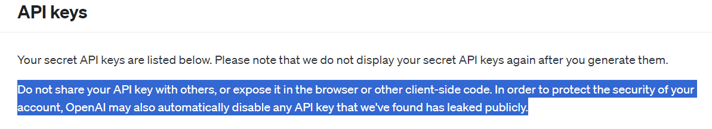
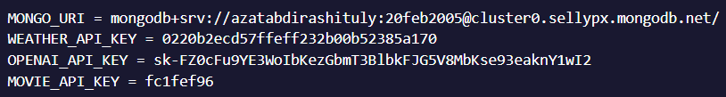

Name: Website for Image Generation and Searching Movies

BEFORE RUNNING THE PROGRAM YOU SHOULD INSTALL PACKAGES BY FOLLOWING:
    npm install OR npm i;

Notation
</img>
Since in this project used API from OPENAI, API must be secure, otherwise API will be deleted from OPENAI account. 
So to run program successfully, you can create a new file called .env, and paste there following variables:
</img>

All these inctructions for keeping the OPENAI API for image generation. If something went wrong (probably, OPENAI managed to disable the key), then you should create OPENAI account by following link: https://platform.openai.com/api-keys, and generate API key, then paste it into code.

Or in successfill case YOU CAN RUN THE PROGRAM: 
    npm start

    ------------------------------
    |TO GET ACCESS TO ADMIN PAGE |
    |    username: Azat          |
    |    password: azat          |
    ------------------------------

ABOUT API ->
    Image generation: OPENAI API
        link: https://platform.openai.com/api-keys
    Movie search: OMDb API
        link: https://www.omdbapi.com/
    Weather information: OpenWeather API
        link: https://openweathermap.org/api

PROJECT STRUCTURE/DIRECTORIES =>

    controller =>
        controllers.js file: contains all functions to be executed such as registrating, logging and redirecting users;
        adminController.js file: contains all functions to be executed by admin
        imageController.js file: contains functions to generate images and get access to history to see generated images 
        movieController.js file: contains functions to get movie data and get access to history to see searched movies
        weatherController.js file: contains functions to get weather data and get access to history to see searched cities with weather data

    database =>
        schemas.js file: contains schemas, database collections for MongoDB

    public =>
        images => contains all related images for project
        styles => contains all css styles for ejs files

    routes =>
        router.js file: contains all routes for routing users, movies, images, weather infos and the admin

    views =>
        pages => contains all ejs files

    .env file => contains API keys

    .gitignore => ignores node_modules folder and package-lock.json file.

    